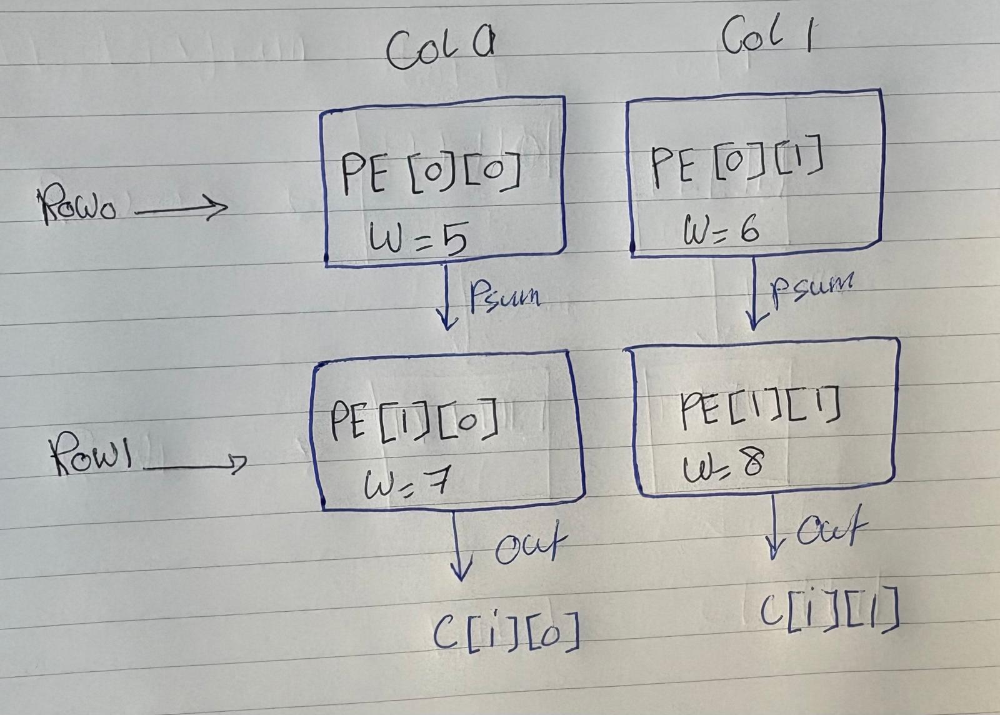
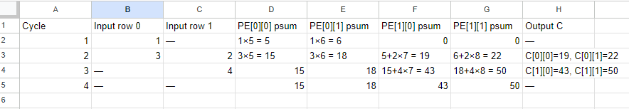

# CMAN: Systolic Array Trace (Weight-Stationary)
**ECE 410/510 | Codefest 5 | Spring 2026**

C = A x B. A = [[1,2],[3,4]], B = [[5,6],[7,8]], C = [[19,22],[43,50]].

---

## (a) PE Diagram

Weights load once and stay put. Each cycle, one input value streams in from the left into each PE row. The partial sum from row 0 passes down to row 1, which adds its own product. C exits the bottom of each column.

PE[r][c] holds weight B[r][c]. Row 0 PEs receive the first element of each A row. Row 1 PEs receive the second element one cycle later.

---

## (b) Cycle Table

Row 1 inputs are skewed by one cycle relative to row 0.

Cycle 2: PE[1][0] gets psum 5 from PE[0][0] (cycle 1) and adds 2x7=14, giving C[0][0]=19.
Cycle 3: PE[1][0] gets psum 15 from PE[0][0] (cycle 2) and adds 4x7=28, giving C[1][0]=43.

---

## (c) Counts

**MACs:** 4 PEs x 2 MACs each = **8 total**.

**Input reuse:** Each A value feeds into 2 PEs at once (both columns in the same row get the same input). Every input is reused **2 times**.

**Off-chip accesses:**
- A: 4 reads
- B: 4 reads (preload)
- C: 4 writes
- Total: **12**

---

## (d) Output-Stationary

In output-stationary, the partial sums stay in each PE while activations and weights flow through.
