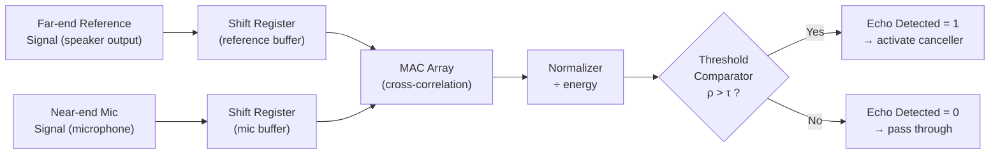

# Algorithm Block Diagram

```mermaid
flowchart LR
    A["Far-end Reference\nSignal (speaker output)"] --> C["Shift Register\n(reference buffer)"]
    B["Near-end Mic\nSignal (microphone)"] --> D["Shift Register\n(mic buffer)"]

    C --> E["MAC Array\n(cross-correlation)"]
    D --> E

    E --> F["Normalizer\n÷ energy"]
    F --> G{"Threshold\nComparator\nρ > τ ?"}

    G -- Yes --> H["Echo Detected = 1\n→ activate canceller"]
    G -- No --> I["Echo Detected = 0\n→ pass through"]
```
